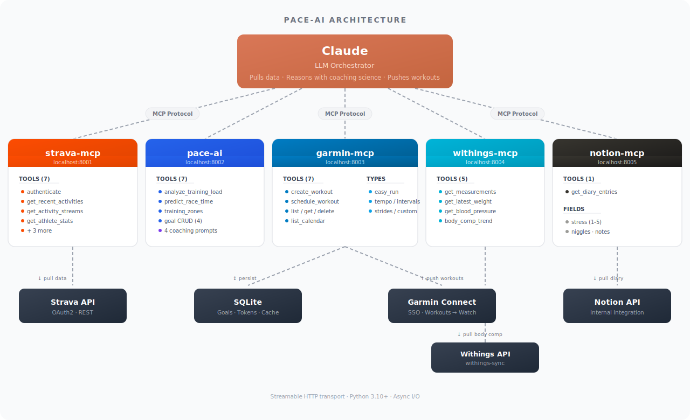

# Pace-AI

AI running coach powered by MCP — connects Claude to your Strava data for personalized training analysis, race predictions, evidence-based coaching, and structured workout delivery to your Garmin watch.

Three MCP servers in one monorepo. Claude orchestrates between them: pulls training data from Strava, reasons using sports-science coaching methodology, and pushes structured workouts to Garmin Connect.

<p align="center">
  
</p>

## Quick Start

### 1. Create a Strava API App

Go to [strava.com/settings/api](https://www.strava.com/settings/api) and create an application:
- **Authorization Callback Domain**: `localhost`
- Note your **Client ID** and **Client Secret**

### 2. Install

```bash
git clone https://github.com/aldred-coetzee/Pace-AI.git
cd Pace-AI
pip install -e ./strava-mcp -e ./pace-ai -e ./garmin-mcp
```

### 3. Configure

```bash
cp strava-mcp/.env.example strava-mcp/.env
# Edit strava-mcp/.env — add your STRAVA_CLIENT_ID and STRAVA_CLIENT_SECRET

cp garmin-mcp/.env.example garmin-mcp/.env
# Edit garmin-mcp/.env — add your GARMIN_EMAIL and GARMIN_PASSWORD
```

pace-ai needs no configuration (all settings have defaults).

garmin-mcp requires a one-time login (handles MFA):
```bash
garmin-mcp-login
```

### 4. Add to Claude

**Claude Desktop** — edit `claude_desktop_config.json`:

```json
{
  "mcpServers": {
    "strava-mcp": {
      "command": "strava-mcp",
      "type": "streamableHttp",
      "url": "http://127.0.0.1:8001/mcp"
    },
    "pace-ai": {
      "command": "pace-ai",
      "type": "streamableHttp",
      "url": "http://127.0.0.1:8002/mcp"
    },
    "garmin-mcp": {
      "command": "garmin-mcp",
      "type": "streamableHttp",
      "url": "http://127.0.0.1:8003/mcp"
    }
  }
}
```

**Claude Code** — add to `.claude/settings.json`:

```json
{
  "mcpServers": {
    "strava-mcp": {
      "type": "streamableHttp",
      "url": "http://127.0.0.1:8001/mcp"
    },
    "pace-ai": {
      "type": "streamableHttp",
      "url": "http://127.0.0.1:8002/mcp"
    },
    "garmin-mcp": {
      "type": "streamableHttp",
      "url": "http://127.0.0.1:8003/mcp"
    }
  }
}
```

### 5. Start a Conversation

Start all three servers, then ask Claude:

```bash
strava-mcp &
pace-ai &
garmin-mcp &
```

> "Authenticate with Strava, then analyze my last 4 weeks of running and give me a weekly plan."

> "Create a 30-minute easy run workout in Zone 1 and schedule it for Monday on my Garmin."

Claude will pull your activities, compute ACWR and training zones, generate a personalized plan, and push structured workouts to your Garmin watch.

## What You Can Do

### strava-mcp — Data Access (7 tools, 2 resources)

| Tool | Description |
|------|-------------|
| `authenticate` | Trigger Strava OAuth flow (opens browser) |
| `get_athlete` | Athlete profile |
| `get_recent_activities` | Recent activities with pace, HR, elevation |
| `get_activity` | Full detail for one activity (splits, laps) |
| `get_activity_streams` | Time-series data (HR, GPS, cadence, altitude) |
| `get_athlete_stats` | Year-to-date and all-time stats |
| `get_athlete_zones` | Heart rate and power zone definitions |

### pace-ai — Coaching Intelligence (7 tools, 4 prompts, 2 resources)

| Tool | Description |
|------|-------------|
| `analyze_training_load` | ACWR calculation with injury risk classification |
| `predict_race_time` | VDOT + Riegel race time predictions |
| `calculate_training_zones` | Daniels' pace and HR zones |
| `set_goal` | Store a race goal (distance, target time, date) |
| `get_goals` | List all goals |
| `update_goal` | Update a goal |
| `delete_goal` | Delete a goal |

| Prompt | Description |
|--------|-------------|
| `weekly_plan` | Structured weekly training plan with methodology |
| `run_analysis` | Post-run coaching analysis |
| `race_readiness` | Race readiness assessment |
| `injury_risk` | Injury risk assessment from load patterns |

### garmin-mcp — Workout Delivery (7 tools, 1 resource)

| Tool | Description |
|------|-------------|
| `authenticate` | Check/resume Garmin Connect session |
| `create_workout` | Create workout by type (easy_run, run_walk, tempo, intervals, strides, custom) |
| `list_workouts` | List workouts in Garmin Connect |
| `get_workout` | Get workout details by ID |
| `delete_workout` | Delete a workout |
| `schedule_workout` | Schedule workout to a calendar date (syncs to watch) |
| `list_calendar` | List scheduled items for a month |

Workout types support HR zone targeting (Garmin zones 1–5), warmup/cooldown, and repeat groups.

## Configuration

| Variable | Default | Description |
|----------|---------|-------------|
| `STRAVA_CLIENT_ID` | *(required)* | From Strava API settings |
| `STRAVA_CLIENT_SECRET` | *(required)* | From Strava API settings |
| `STRAVA_ACCESS_TOKEN` | *(empty)* | Optional bootstrap token |
| `STRAVA_REFRESH_TOKEN` | *(empty)* | Optional bootstrap token |
| `STRAVA_MCP_HOST` | `127.0.0.1` | strava-mcp bind address |
| `STRAVA_MCP_PORT` | `8001` | strava-mcp HTTP port |
| `STRAVA_MCP_DB` | `strava_mcp.db` | SQLite path (tokens + cache) |
| `PACE_AI_HOST` | `127.0.0.1` | pace-ai bind address |
| `PACE_AI_PORT` | `8002` | pace-ai HTTP port |
| `PACE_AI_DB` | `pace_ai.db` | SQLite path (goals) |
| `GARMIN_EMAIL` | *(required)* | Garmin Connect login email |
| `GARMIN_PASSWORD` | *(required)* | Garmin Connect login password |
| `GARMIN_MCP_PORT` | `8003` | garmin-mcp HTTP port |
| `GARTH_HOME` | `~/.garth` | Garth session token directory |

## Development

```bash
# Install in dev mode
pip install -e ./strava-mcp[dev] -e ./pace-ai[dev] -e ./garmin-mcp[dev]

# Run tests
cd strava-mcp && python -m pytest tests/ && cd ..
cd pace-ai && python -m pytest tests/ && cd ..
cd garmin-mcp && python -m pytest tests/ && cd ..

# Lint
ruff check strava-mcp/ pace-ai/ garmin-mcp/
ruff format --check strava-mcp/ pace-ai/ garmin-mcp/
```

See [strava-mcp/README.md](strava-mcp/README.md), [pace-ai/README.md](pace-ai/README.md), and [garmin-mcp/README.md](garmin-mcp/README.md) for server-specific details.

## License

[MIT](LICENSE)
