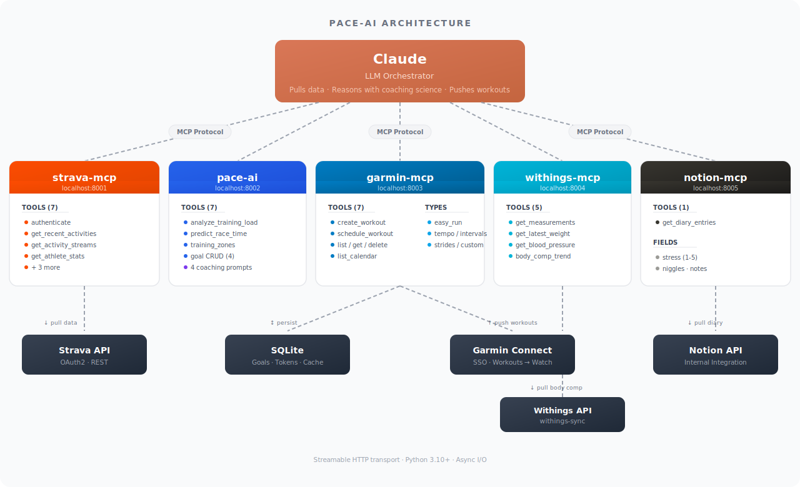

# Pace-AI

AI running coach powered by MCP — connects Claude to your Strava, Garmin, Withings, and Notion data for evidence-based coaching, structured workout delivery to your watch, and a web-based coaching UI.

Five MCP servers in one monorepo, plus a Flask web UI that orchestrates multi-prompt coaching sessions. Claude pulls training data from Strava, wellness from Garmin, body composition from Withings, diary entries from Notion, reasons using a 3,113-claim sports-science evidence base, and pushes structured workouts to your Garmin watch.

<p align="center">
  
</p>

## Web UI

The Flask UI (`localhost:5050`) provides a coaching dashboard with 5 focused agents, each receiving only the context it needs:

| Agent | Trigger | Context | Purpose |
|-------|---------|---------|---------|
| **STATUS** | Status button | Profile, activities, wellness, body comp, Garmin calendar, diary, coaching log | Full training status assessment |
| **PLAN** | Plan button + date range | Status snapshot, research evidence, athlete facts, coaching context | Generate evidence-based training plan |
| **CHAT** | Text input | Profile summary, facts, coaching context, pending plan | Conversational Q&A and plan tweaks |
| **EXERCISE** | Schedule button | Plan JSON only | Add structured exercises to strength/mobility sessions |
| **END SESSION** | End Session button | Full conversation history, coaching context | Summarise session, update coaching memory |

```bash
python ui/app.py    # opens http://localhost:5050
```

**Workflow:** Sync All → Status → Plan → tweak via chat → Schedule → End Session

## Quick Start

### 1. Create API Apps

- **Strava**: [strava.com/settings/api](https://www.strava.com/settings/api) — callback domain `localhost`
- **Withings**: [developer.withings.com](https://developer.withings.com) — create an app
- **Notion**: [notion.so/my-integrations](https://www.notion.so/my-integrations) — internal integration with read access to your diary database
- **Garmin**: No API app needed — uses Garmin Connect SSO login

### 2. Install

```bash
git clone https://github.com/aldred-coetzee/Pace-AI.git
cd Pace-AI
pip install -e ./strava-mcp -e ./pace-ai -e ./garmin-mcp -e ./withings-mcp -e ./notion-mcp
```

### 3. Configure

```bash
cp strava-mcp/.env.example strava-mcp/.env
# Edit: STRAVA_CLIENT_ID, STRAVA_CLIENT_SECRET

cp garmin-mcp/.env.example garmin-mcp/.env
# Edit: GARMIN_EMAIL, GARMIN_PASSWORD

cp withings-mcp/.env.example withings-mcp/.env
# Edit: WITHINGS_CLIENT_ID, WITHINGS_CLIENT_SECRET

cp notion-mcp/.env.example notion-mcp/.env
# Edit: NOTION_TOKEN, NOTION_DIARY_DATABASE_ID
```

Garmin requires a one-time login (handles MFA):
```bash
garmin-mcp-login
```

### 4. Start Servers

```bash
strava-mcp &       # localhost:8001
pace-ai &          # localhost:8002
garmin-mcp &       # localhost:8003
withings-mcp &     # localhost:8004
notion-mcp &       # localhost:8005
```

### 5. Use

**Web UI** (recommended):
```bash
python ui/app.py   # localhost:5050
```

**Claude Desktop / Claude Code** — add to MCP config:

```json
{
  "mcpServers": {
    "strava-mcp": { "type": "streamableHttp", "url": "http://127.0.0.1:8001/mcp" },
    "pace-ai": { "type": "streamableHttp", "url": "http://127.0.0.1:8002/mcp" },
    "garmin-mcp": { "type": "streamableHttp", "url": "http://127.0.0.1:8003/mcp" },
    "withings-mcp": { "type": "streamableHttp", "url": "http://127.0.0.1:8004/mcp" },
    "notion-mcp": { "type": "streamableHttp", "url": "http://127.0.0.1:8005/mcp" }
  }
}
```

## MCP Servers

### strava-mcp — Data Access (12 tools, 2 resources)

| Tool | Description |
|------|-------------|
| `authenticate` | Trigger Strava OAuth flow |
| `get_athlete` | Athlete profile |
| `get_recent_activities` | Recent activities with pace, HR, elevation |
| `get_activity` | Full activity detail (splits, laps) |
| `get_activity_streams` | Time-series data (HR, GPS, cadence, altitude) |
| `get_athlete_stats` | Year-to-date and all-time stats |
| `get_athlete_zones` | Heart rate and power zone definitions |
| `get_best_efforts` | Personal bests for standard distances |
| `get_weekly_summary` | Rolling weekly aggregates |
| `get_shoe_mileage` | Shoe mileage with retirement warnings |
| `search_activities` | Search/filter activities by type, distance, name |
| `get_segment_analysis` | Repeated segment comparison over time |

### pace-ai — Coaching Intelligence (43 tools, 4 prompts, 3 resources)

**Analysis (8 tools):** ACWR (weekly + daily EWMA), VDOT race prediction, Daniels training zones, Karvonen HR zones, cardiac decoupling, fitness trend assessment, race readiness scoring.

**Run Analysis (5 tools):** Structured single-run analysis, workout type auto-classification, intensity distribution / 80-20 check, data anomaly detection.

**Sync (7 tools):** Incremental sync from Strava, Garmin wellness, Garmin workouts, Withings, Notion. Sync status tracking. One-call `sync_all`.

**History (7 tools):** Weekly distances, recent activities (local), wellness snapshots, diary entries, race history, personal bests.

**Coaching Memory (8 tools):** Append-only coaching log, coaching context (read/rewrite), athlete facts (injury, preference, goal, training response), coaching log search.

**Profile (3 tools):** Auto-generate profile from synced data, get/update manual profile fields.

**Goals (4 tools):** CRUD for race goals (type, target time, date, notes).

**Environment (2 tools):** Heat and altitude pace adjustments.

**Evidence (1 tool):** Query 3,113 peer-reviewed claims across 54 research categories.

| Prompt | Description |
|--------|-------------|
| `weekly_plan` | Weekly training plan with research evidence |
| `run_analysis` | Post-run coaching analysis |
| `race_readiness` | Race readiness assessment |
| `injury_risk` | Injury risk from load patterns |

### garmin-mcp — Workout Delivery + Wellness (17 tools, 1 resource)

**Workouts (10 tools):** Create, list, get, delete, schedule, unschedule workouts. Combined create-and-schedule. Calendar listing. Supports easy_run, run_walk, tempo, intervals, strides, strength, mobility, yoga, cardio, hiit, walking, custom workout types with HR zone targeting.

**Wellness (7 tools):** Body battery, sleep score, HRV, training readiness, stress, resting HR, combined wellness snapshot.

### withings-mcp — Body Composition (5 tools, 1 resource)

| Tool | Description |
|------|-------------|
| `authenticate` | Check Withings connection |
| `get_measurements` | Weight, body fat %, muscle mass, bone mass, body water |
| `get_latest_weight` | Most recent weight measurement |
| `get_blood_pressure` | Systolic, diastolic, heart rate |
| `get_body_composition_trend` | Weekly averages over time |

### notion-mcp — Running Diary (1 tool, 1 resource)

| Tool | Description |
|------|-------------|
| `get_diary_entries` | Sync and return diary entries (stress 1-5, niggles, notes) |

## Research Evidence

The coaching system is grounded in a database of 3,113 claims extracted from 520 peer-reviewed papers across 54 research categories. Claims are scored by population relevance and injected into coaching prompts via RAG.

Categories always queried for weekly plans:

| Category | Claims | Coverage |
|----------|--------|----------|
| strength_training_runners | 64 | Running economy, frequency, exercise selection |
| foam_rolling_mobility | 47 | ROM effects, warm-up vs recovery, protocols |
| warmup_cooldown | 72 | Static vs dynamic stretching, optimal warm-up |
| recovery_modalities | 54 | Compression, cold water, massage, foam rolling |
| concurrent_training | 59 | Strength + running interference, programming |
| overtraining_recovery | 60 | Load monitoring, monotony, session RPE |
| sleep_recovery | 60 | Sleep loss effects, performance impact |
| training_load_acwr | 70 | ACWR thresholds, injury risk, load management |
| injury_prevention_general | 57 | Gait retraining, strength for injury reduction |
| easy_recovery_running | 49 | Aerobic base, fat oxidation, mitochondrial |

Conditionally added: tendon_health, injury_lower_leg, injury_knee, injury_stress_fracture, return_to_running, detraining, marathon/half/5k training, masters_running.

## Configuration

| Variable | Default | Description |
|----------|---------|-------------|
| `STRAVA_CLIENT_ID` | *(required)* | From Strava API settings |
| `STRAVA_CLIENT_SECRET` | *(required)* | From Strava API settings |
| `STRAVA_MCP_PORT` | `8001` | strava-mcp HTTP port |
| `PACE_AI_PORT` | `8002` | pace-ai HTTP port |
| `GARMIN_EMAIL` | *(required)* | Garmin Connect login |
| `GARMIN_PASSWORD` | *(required)* | Garmin Connect password |
| `GARMIN_MCP_PORT` | `8003` | garmin-mcp HTTP port |
| `GARTH_HOME` | `~/.garth` | Garth session token directory |
| `WITHINGS_CLIENT_ID` | *(required)* | From Withings developer portal |
| `WITHINGS_CLIENT_SECRET` | *(required)* | From Withings developer portal |
| `WITHINGS_MCP_PORT` | `8004` | withings-mcp HTTP port |
| `NOTION_TOKEN` | *(required)* | Notion internal integration secret |
| `NOTION_DIARY_DATABASE_ID` | *(required)* | Notion database ID for diary |
| `NOTION_MCP_PORT` | `8005` | notion-mcp HTTP port |

## Development

```bash
# Install in dev mode
pip install -e ./strava-mcp[dev] -e ./pace-ai[dev] -e ./garmin-mcp[dev] -e ./withings-mcp[dev] -e ./notion-mcp[dev]

# Run tests (all servers)
cd strava-mcp && python -m pytest tests/ && cd ..
cd pace-ai && python -m pytest tests/ && cd ..
cd garmin-mcp && python -m pytest tests/ && cd ..
cd withings-mcp && python -m pytest tests/ && cd ..
cd notion-mcp && python -m pytest tests/ && cd ..

# Lint
ruff check strava-mcp/ pace-ai/ garmin-mcp/ withings-mcp/ notion-mcp/ ui/
ruff format --check strava-mcp/ pace-ai/ garmin-mcp/ withings-mcp/ notion-mcp/ ui/
```

793 tests across unit, integration, and e2e suites. E2e tests boot each server as a subprocess and verify HTTP response.

See individual server READMEs for server-specific details: [strava-mcp](strava-mcp/README.md), [pace-ai](pace-ai/README.md), [garmin-mcp](garmin-mcp/README.md), [withings-mcp](withings-mcp/README.md), [notion-mcp](notion-mcp/README.md).

## License

[MIT](LICENSE)
